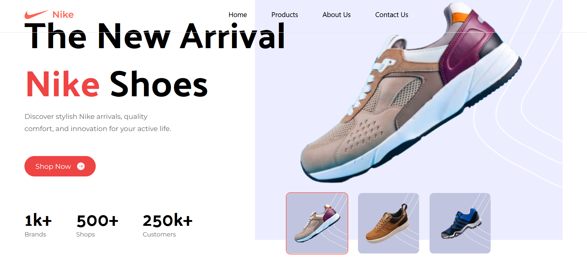
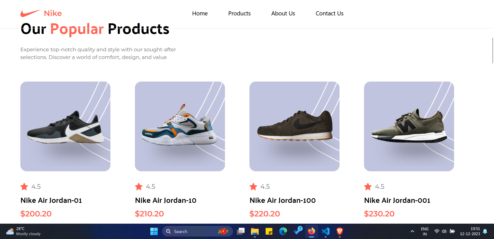
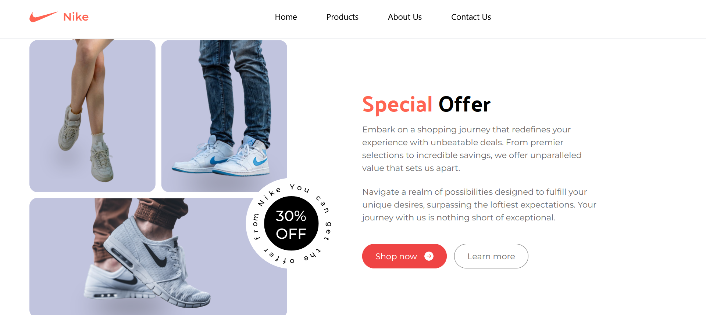
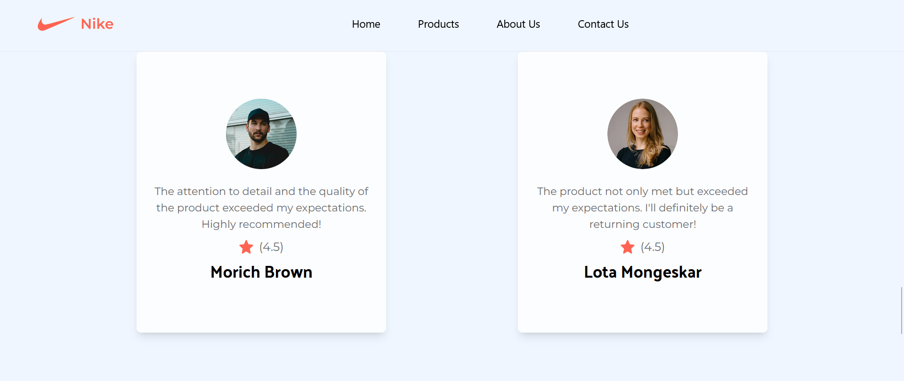
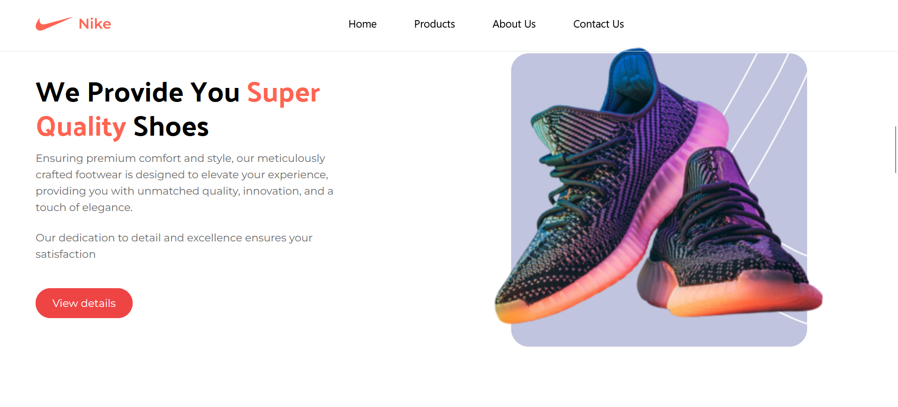
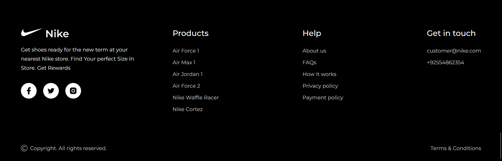

## Technologies Used

This static website is crafted using modern and trending technologies:

    Vite: A next-generation frontend build tool that enhances the development experience.
    React: A powerful and widely adopted JavaScript library for building user interfaces.
    Tailwind CSS: A utility-first CSS framework that ensures a clean and maintainable codebase.

Feel the energy, embrace the style – welcome to the Nike Static Web Page, where responsiveness meets the spirit of sport. Explore, discover, and be inspired as you navigate through the dynamic world of Nike.

# Nike Static Web Page

)

Welcome to the Nike Static Web Page – a responsive and immersive digital experience that seamlessly blends style, innovation, and the spirit of excellence. Explore our interactive hero section, discover the latest products, read authentic reviews, and learn more about the iconic brand.

## Interactive Hero Section

Our hero section is designed to captivate and engage. Enjoy a dynamic canvas that responds to various devices, providing an interactive introduction to the world of Nike. Stunning visuals and animations set the stage for an unforgettable journey.

## Product Showcases

Discover the latest and greatest Nike products in our responsive showcase. From cutting-edge sportswear to iconic footwear, our product sections are crafted to look exceptional on all devices. Whether you're on a desktop, tablet, or smartphone, the Nike experience remains seamless.

## Reviews that Speak Volumes

Join the conversation in our Reviews section. Read real stories from the Nike community and share your own experiences. Our responsive design ensures that you can engage with fellow enthusiasts and explore reviews comfortably from any device.

## About Us – Beyond the Swoosh

Dive into the story behind the Swoosh in our About Us section. Our responsive design guarantees a consistent and enjoyable reading experience across devices. Learn about Nike's heritage, values, and commitments that shape the brand.

## Seamless Responsiveness

Our website is meticulously designed for responsiveness. Whether you're browsing on a large desktop monitor, a tablet, or a smartphone, the Nike Static Web Page adapts to your screen size. Enjoy a consistent and visually appealing experience across all devices.

Feel the energy, embrace the style – welcome to the Nike Static Web Page, where responsiveness meets the spirit of sport. Explore, discover, and be inspired as you navigate through the dynamic world of Nike.

**Note:** Replace "link-to-hero-image.png" with the actual URL or path to your hero image. Ensure all images are optimized for web and GitHub rendering.
